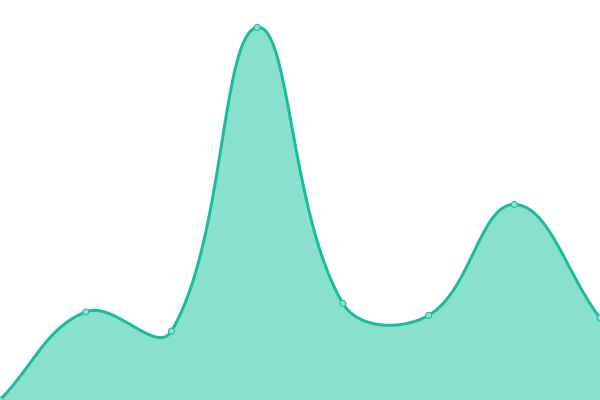

# [📈 Live Status](https://webcheck.cpluz.com): <!--live status--> **🟧 Partial outage**

This repository contains the open-source uptime monitor and status page for [Cpluz](cpluz.com), powered by [Upptime](https://github.com/upptime/upptime).

With [Upptime](https://upptime.js.org), you can get your own unlimited and free uptime monitor and status page, powered entirely by a GitHub repository. We use [Issues](https://github.com/Cpluz/sitecheck/issues) as incident reports, [Actions](https://github.com/Cpluz/sitecheck/actions) as uptime monitors, and [Pages](https://webcheck.cpluz.com) for the status page.

<!--start: status pages-->
<!-- This summary is generated by Upptime (https://github.com/upptime/upptime) -->
<!-- Do not edit this manually, your changes will be overwritten -->
<!-- prettier-ignore -->
| URL | Status | History | Response Time | Uptime |
| --- | ------ | ------- | ------------- | ------ |
|  [Cpluz](https://www.cpluz.com) | 🟩 Up | [cpluz.yml](https://github.com/Cpluz/sitecheck-old/commits/HEAD/history/cpluz.yml) | 

 5405ms
     
 | 

<a href="https://Cpluz.github.io/sitecheck/history/cpluz">91.00%</a>
    

|  [Cpluz Accounts](https://acc.cpluz.com) | 🟩 Up | [cpluz-accounts.yml](https://github.com/Cpluz/sitecheck-old/commits/HEAD/history/cpluz-accounts.yml) | 

 5393ms
     
 | 

<a href="https://Cpluz.github.io/sitecheck/history/cpluz-accounts">93.72%</a>
    

|  [Z Accounts](https://accounts.cpluz.com) | 🟩 Up | [z-accounts.yml](https://github.com/Cpluz/sitecheck-old/commits/HEAD/history/z-accounts.yml) | 

 2749ms
     
 | 

<a href="https://Cpluz.github.io/sitecheck/history/z-accounts">99.81%</a>
    

|  [S Accounts](https://accounts.cpluz.in) | 🟥 Down | [s-accounts.yml](https://github.com/Cpluz/sitecheck-old/commits/HEAD/history/s-accounts.yml) | 

 591ms
     
 | 

<a href="https://Cpluz.github.io/sitecheck/history/s-accounts">0.00%</a>
    

|  [Serverify](https://serverify.in) | 🟩 Up | [serverify.yml](https://github.com/Cpluz/sitecheck-old/commits/HEAD/history/serverify.yml) | 

 1144ms
     
 | 

<a href="https://Cpluz.github.io/sitecheck/history/serverify">100.00%</a>
    

|  [Vasanthamdoors](https://vasanthamdoors.com) | 🟩 Up | [vasanthamdoors.yml](https://github.com/Cpluz/sitecheck-old/commits/HEAD/history/vasanthamdoors.yml) | 

 5444ms
     
 | 

<a href="https://Cpluz.github.io/sitecheck/history/vasanthamdoors">95.01%</a>
    

|  [Ispearexports](https://ispearexports.com) | 🟩 Up | [ispearexports.yml](https://github.com/Cpluz/sitecheck-old/commits/HEAD/history/ispearexports.yml) | 

 2899ms
     
 | 

<a href="https://Cpluz.github.io/sitecheck/history/ispearexports">100.00%</a>
    

|  [Shrijayan](https://shrijayan.cpluz.com) | 🟩 Up | [shrijayan.yml](https://github.com/Cpluz/sitecheck-old/commits/HEAD/history/shrijayan.yml) | 

 3234ms
     
 | 

<a href="https://Cpluz.github.io/sitecheck/history/shrijayan">99.82%</a>
    

|  [GPU Calculator](https://calgpu.cpluz.com) | 🟩 Up | [gpu-calculator.yml](https://github.com/Cpluz/sitecheck-old/commits/HEAD/history/gpu-calculator.yml) | 

 431ms
     
 | 

<a href="https://Cpluz.github.io/sitecheck/history/gpu-calculator">93.11%</a>
    

|  [Aameco](https://aameco.in) | 🟩 Up | [aameco.yml](https://github.com/Cpluz/sitecheck-old/commits/HEAD/history/aameco.yml) | 

 2317ms
     
 | 

<a href="https://Cpluz.github.io/sitecheck/history/aameco">100.00%</a>
    

|  [Kingtraderss](https://kingtraderss.com) | 🟩 Up | [kingtraderss.yml](https://github.com/Cpluz/sitecheck-old/commits/HEAD/history/kingtraderss.yml) | 

 4305ms
     
 | 

<a href="https://Cpluz.github.io/sitecheck/history/kingtraderss">96.01%</a>
    

|  [Accounts Kingtraderss](https://accounts.kingtraderss.com) | 🟩 Up | [accounts-kingtraderss.yml](https://github.com/Cpluz/sitecheck-old/commits/HEAD/history/accounts-kingtraderss.yml) | 

 3586ms
     
 | 

<a href="https://Cpluz.github.io/sitecheck/history/accounts-kingtraderss">91.93%</a>
    

|  [Inventory Kingtraderss](https://inventory.kingtraderss.com) | 🟩 Up | [inventory-kingtraderss.yml](https://github.com/Cpluz/sitecheck-old/commits/HEAD/history/inventory-kingtraderss.yml) | 

 3652ms
     
 | 

<a href="https://Cpluz.github.io/sitecheck/history/inventory-kingtraderss">97.79%</a>
    

|  [Baseefy](https://baseefy.com) | 🟩 Up | [baseefy.yml](https://github.com/Cpluz/sitecheck-old/commits/HEAD/history/baseefy.yml) | 

 1734ms
     
 | 

<a href="https://Cpluz.github.io/sitecheck/history/baseefy">95.54%</a>
    

|  [Winnovin](https://winnovin.com) | 🟩 Up | [winnovin.yml](https://github.com/Cpluz/sitecheck-old/commits/HEAD/history/winnovin.yml) | 

 7855ms
     
 | 

<a href="https://Cpluz.github.io/sitecheck/history/winnovin">97.82%</a>
    

|  [Inventory Winnovin](https://inventory.winnovin.com) | 🟩 Up | [inventory-winnovin.yml](https://github.com/Cpluz/sitecheck-old/commits/HEAD/history/inventory-winnovin.yml) | 

 4893ms
     
 | 

<a href="https://Cpluz.github.io/sitecheck/history/inventory-winnovin">99.81%</a>
    

|  [Viyaanexport](https://viyaanexport.com) | 🟩 Up | [viyaanexport.yml](https://github.com/Cpluz/sitecheck-old/commits/HEAD/history/viyaanexport.yml) | 

 445ms
     
 | 

<a href="https://Cpluz.github.io/sitecheck/history/viyaanexport">73.71%</a>
    

|  [Vihandesigns COM](https://vihandesigns.com) | 🟩 Up | [vihandesigns-com.yml](https://github.com/Cpluz/sitecheck-old/commits/HEAD/history/vihandesigns-com.yml) | 

 399ms
     
 | 

<a href="https://Cpluz.github.io/sitecheck/history/vihandesigns-com">100.00%</a>
    

|  [Vihandesigns IN](https://vihandesigns.in) | 🟩 Up | [vihandesigns-in.yml](https://github.com/Cpluz/sitecheck-old/commits/HEAD/history/vihandesigns-in.yml) | 

 289ms
     
 | 

<a href="https://Cpluz.github.io/sitecheck/history/vihandesigns-in">100.00%</a>
    

|  [Skyaloft](https://skyaloft.com) | 🟥 Down | [skyaloft.yml](https://github.com/Cpluz/sitecheck-old/commits/HEAD/history/skyaloft.yml) | 

 629ms
     
 | 

<a href="https://Cpluz.github.io/sitecheck/history/skyaloft">0.00%</a>
    

|  [Lunux](https://lunux.in) | 🟩 Up | [lunux.yml](https://github.com/Cpluz/sitecheck-old/commits/HEAD/history/lunux.yml) | 

 3179ms
     
 | 

<a href="https://Cpluz.github.io/sitecheck/history/lunux">73.74%</a>
    

|  [Fuwaindia](https://fuwaindia.in) | 🟩 Up | [fuwaindia.yml](https://github.com/Cpluz/sitecheck-old/commits/HEAD/history/fuwaindia.yml) | 

 3863ms
     
 | 

<a href="https://Cpluz.github.io/sitecheck/history/fuwaindia">73.55%</a>
    

|  [Everyhue](https://everyhue.in) | 🟩 Up | [everyhue.yml](https://github.com/Cpluz/sitecheck-old/commits/HEAD/history/everyhue.yml) | 

 311ms
     
 | 

<a href="https://Cpluz.github.io/sitecheck/history/everyhue">91.25%</a>
    

<!--end: status pages-->

[**Visit our status website →**](https://webcheck.cpluz.com)

## 📄 License

- Powered by: [Upptime](https://github.com/upptime/upptime)
- Code: [MIT](./LICENSE) © [Anand Chowdhary](https://anandchowdhary.com), supported by [Pabio](https://pabio.com)
- Data in the `./history` directory: [Open Database License](https://opendatacommons.org/licenses/odbl/1-0/)
